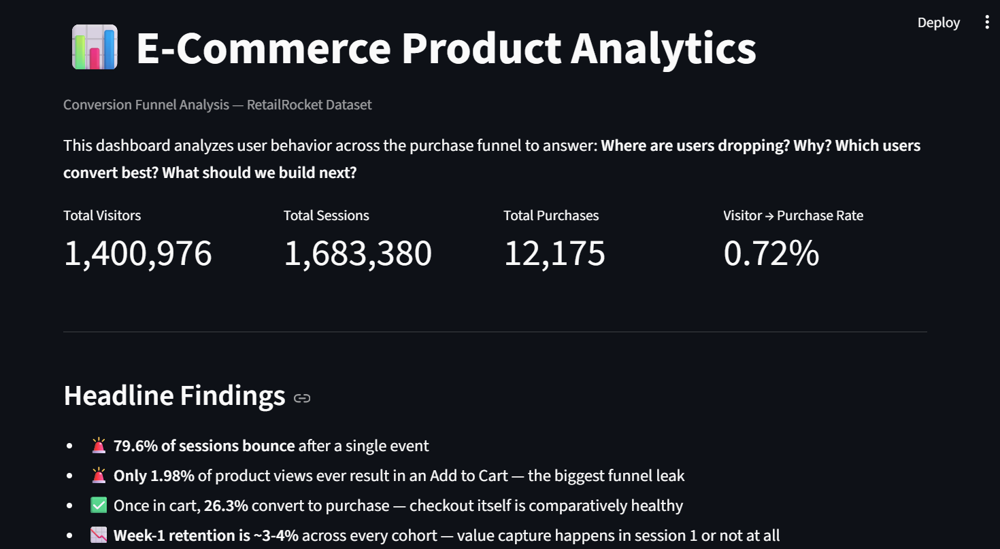
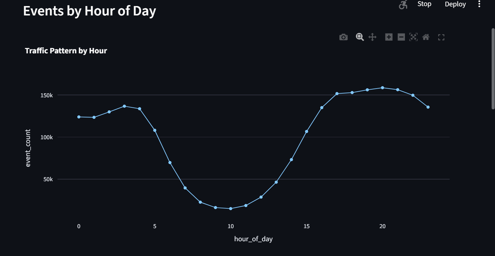
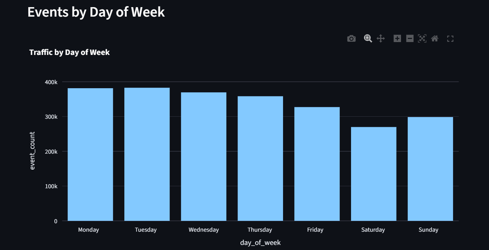
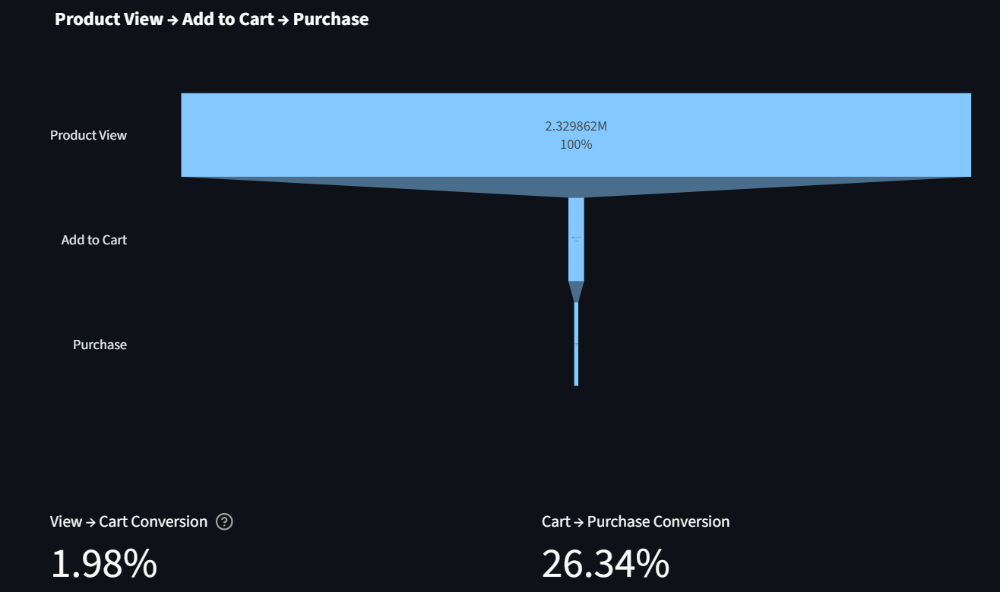
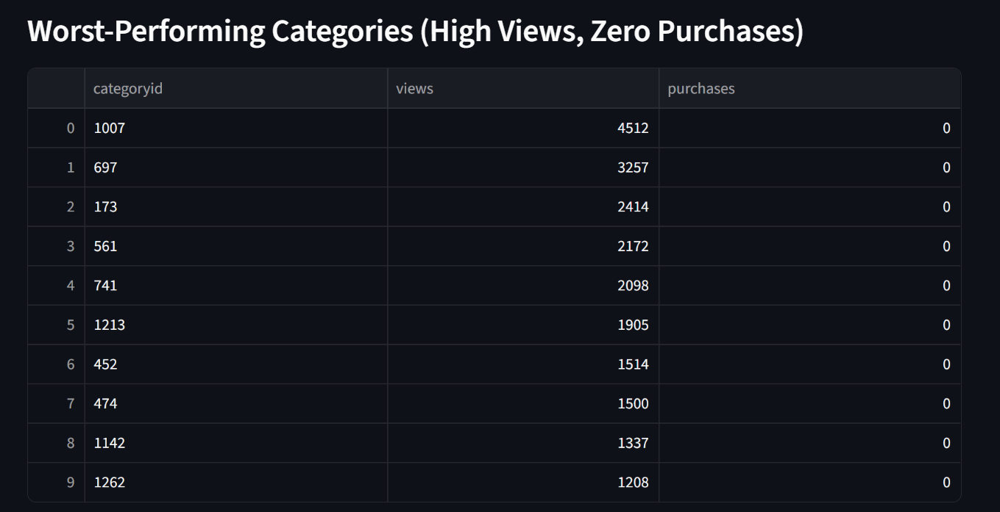
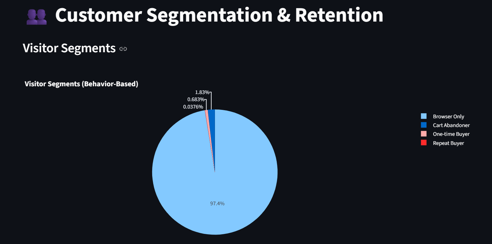
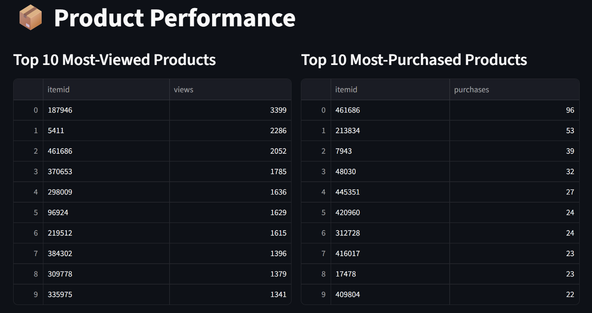

# 📊 E-Commerce Product Analytics & Conversion Funnel Analysis

A full end-to-end product analytics case study — from raw event data to a live Streamlit dashboard — diagnosing **where users drop off, why, and what to fix** for an e-commerce platform.

Built on the [RetailRocket](https://www.kaggle.com/datasets/retailrocket/ecommerce-dataset) e-commerce events dataset (2.75M+ raw events, 1.4M visitors).

---

## 🖥️ Live Dashboard Preview

### Home — Headline KPIs


**1,400,976** visitors · **1,683,380** sessions · **12,175** purchases · **0.72%** visitor-to-purchase rate

### EDA — Traffic Patterns



### Funnel Analysis



### Customer Segmentation


### Product Performance


---

## 🧩 Business Problem

The company observed **high website traffic, low conversion rate, and high cart abandonment**. Management needed answers to:

- Where are users dropping in the funnel?
- Why are they dropping?
- Which users convert the most?
- What product changes should be implemented?

---

## 🔑 Headline Findings

| Finding | Number |
|---|---|
| Bounce rate (sessions with only 1 event) | **79.57%** |
| View → Add to Cart conversion (**the biggest leak**) | **1.98%** |
| Cart → Purchase conversion (healthy, by comparison) | **26.34%** |
| Overall Visitor → Purchase conversion | **0.72%** |
| Cart abandonment rate | **73.66%** |
| Week-1 cohort retention (every cohort) | **~3–4%** |
| Visitors who are "Browser Only" (never add to cart) | **97.45%** |
| Repeat purchasers | **527** out of 1.4M visitors |

**The core insight:** the funnel doesn't leak gradually — it collapses almost entirely at the very first step. Checkout (Cart → Purchase) is comparatively healthy; the real problem is product-page relevance and first-session engagement, not checkout friction.

---

## 🛠️ Tech Stack

- **Python** (pandas) — data cleaning & preprocessing
- **PostgreSQL** — normalized star-schema database, all EDA/funnel/cohort SQL
- **Streamlit + Plotly** — interactive analytics dashboard
- **Git / GitHub** — version control

---

## 📁 Repository Structure

```
Ecommerce-Product-Analytics/
│
│
├── sql/
│   └── schema.sql                 # PostgreSQL star-schema (visitors, items, categories, sessions, events)
│
├── scripts/
│   ├── phase4_cleaning_pipeline.py    # Full preprocessing pipeline (dedup, bot filtering, sessionization)
│
├── app/
│   ├── streamlit_app.py           # 6-page interactive dashboard
│
├── screenshots/                   # Dashboard screenshots used in this README
│
├── report/
│   └── Product_Analytics_Report.pdf   # Full write-up (Executive Summary → Recommendations)
│
├── requirements.txt
└── README.md
```

---

## 🚀 Setup

### 1. Clone the repo
```bash
git clone https://github.com/<your-username>/Ecommerce-Product-Analytics.git
cd Ecommerce-Product-Analytics
```

### 2. Get the data
Download the RetailRocket dataset from [Kaggle](https://www.kaggle.com/datasets/retailrocket/ecommerce-dataset) and place the 4 raw CSVs in `data/` (data files are gitignored due to size — see `.gitignore`).

### 3. Run the cleaning pipeline
```bash
pip install -r requirements.txt
python scripts/phase4_cleaning_pipeline.py
```

### 4. Load into PostgreSQL
Create a database, run `sql/schema.sql`, then import `data/clean_events.csv` (see project notes for the staging-table + normalize approach).

### 5. Launch the dashboard
```bash
cd app
pip install -r requirements.txt
streamlit run streamlit_app.py
```
Enter your Postgres credentials in the sidebar to connect.

---

## 📋 EDA — 30 Questions Answered

<details>
<summary><b>A. Volume & Reach</b></summary>

1. How many unique visitors? → **1,400,976**
2. How many unique sessions? → **1,683,380**
3. How many unique items were interacted with? → **226,791**
4. Total events by funnel stage? → View 2,329,862 / Cart 46,217 / Purchase 12,175
5. Average events per session? → **1.42**
</details>

<details>
<summary><b>B. Sessions & Engagement</b></summary>

6. Average events per visitor? → **1.70**
7. Sessions-per-visitor distribution? → 1,225,302 visitors have exactly 1 session
8. Average session duration? → **1.30 minutes**
9. Bounce (single-event) sessions? → **1,339,432**
10. Bounce rate? → **79.57%**
</details>

<details>
<summary><b>C. Time Patterns</b></summary>

11. Events by hour of day? → Peak at 8–9 PM (158,692 events)
12. Events by day of week? → Peak on Tuesday (382,879 events)
13. Daily event trend over time?
14. Daily purchase trend?
15. Peak purchase hour? → 5 PM (968 purchases)
</details>

<details>
<summary><b>D. Products</b></summary>

16. Top 10 most-viewed products?
17. Top 10 most-purchased products? → Item 461686 leads with 96 purchases
18. Top 10 most-added-to-cart products?
19. Products viewed but never purchased? → **219,051** (96.6% of all items)
20. Best item-level conversion (min. 50 views)? → Item 213834 at **32.72%**
</details>

<details>
<summary><b>E. Categories</b></summary>

21. Top 10 categories by views?
22. Top 10 categories by purchases?
23. Category-level conversion rate (min. 100 views)? → Best: category 1685 at 5.86%
24. Worst-performing categories? → Categories 1007, 697, 173, 561, 741 and others: **1,200–4,500 views, zero purchases**
</details>

<details>
<summary><b>F. Users</b></summary>

25. Returning vs one-time visitors?
26. Visitors who purchased more than once? → **527**
27. % of visitors who ever added to cart? → **2.47%**
28. % of visitors who ever purchased? → **0.72%**
</details>

<details>
<summary><b>G. Cart & Order Behavior</b></summary>

29. Average items per completed order? → **1.14**
30. Cart abandonment rate? → **73.66%**
</details>

---

## 🔻 Funnel Analysis

| Stage | Count | Conversion | Drop-off |
|---|---|---|---|
| Product View | 2,329,862 | — | — |
| Add to Cart | 46,217 | 1.98% | 98.02% |
| Purchase | 12,175 | 26.34% | 73.66% |

**Largest drop:** View → Add to Cart, by a wide margin. Once a user commits to adding an item to cart, they complete the purchase over 13x more often than the average product-page visitor converts to cart. The bottleneck is product-page relevance, not checkout.

---

## 👥 Segmentation & Cohorts

- **97.45%** of visitors are "Browser Only" (view products, never add to cart)
- **1.83%** are Cart Abandoners, **0.68%** One-time Buyers, **0.04%** Repeat Buyers
- Repeat Buyers average **2.72 sessions** and **6.13 views** vs Browser Only's 1.19 sessions / 1.61 views
- **Every weekly cohort** shows the same pattern: ~100% → ~3-4% retention by Week 1, flattening to a thin loyal tail (~0.7–1%) after Week 2
- Repeat purchase rate is **flat at ~0.7%** across 5 months — a structural issue, not a recent regression

---

## 🧪 A/B Testing Recommendations

1. **Product Page Relevance Test** (recommended first — reaches significance in days): social proof + imagery improvements targeting View → Cart conversion
2. **Checkout Redesign Test** (as originally scoped): simplified checkout flow targeting cart abandonment — needs ~18,800 users (~2 months of traffic) to reach significance

---

## 💡 Key Recommendations

1. **Audit zero-purchase, high-traffic categories** (1007, 697, 173, 561, 741…) for pricing, imagery, and stock accuracy
2. **Improve product-page/search relevance** — the real leak is upstream of checkout
3. **Don't over-invest in checkout optimization** — Cart → Purchase is already comparatively strong
4. **Invest in first-session experience** — nearly all value capture happens in session 1
5. **Study top-converting categories** (1685 at 5.86%, 340 at 5.14%) to replicate what's working

---

## 📌 Data Limitations

- No `price` field in RetailRocket — AOV/Revenue KPIs are approximated or omitted
- No `device`/`country` fields — device and geographic segmentation aren't available in this dataset
- Bot traffic (~6,600 visitors, 367K events) filtered using a 99.5th-percentile event-count threshold

---

## 📄 License

This project uses the publicly available RetailRocket dataset for educational/portfolio purposes.
